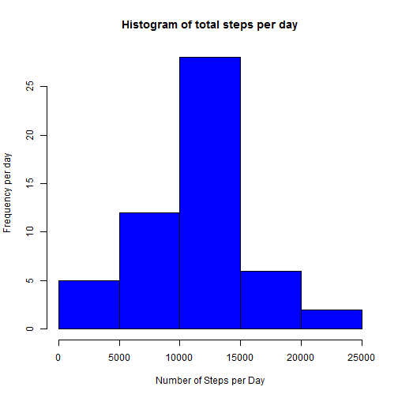
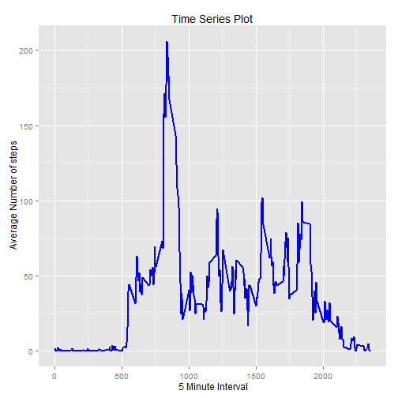
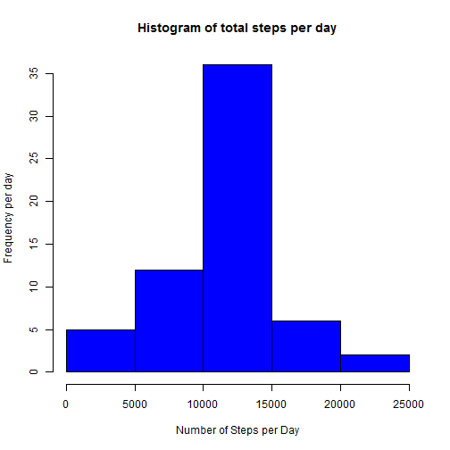
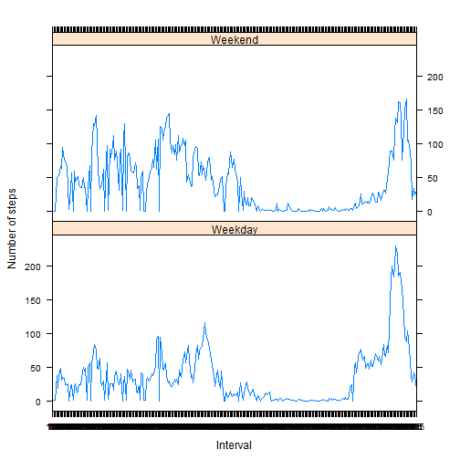

This document presents the R code and the results of the assignment in a single R markdown document so it can be processed by knitr and be transformed into an HTML file.
Code chunks in the document, will use echo = TRUE so that the code can be read by others.

## Loading and preprocessing the data


```r
require(knitr)
library(ggplot2) #used for plotting
#Read the data such that steps is integer, date is Date and interval is a Factor
actdata <- read.table('activity.csv',sep = ",",header = TRUE, na.strings ="NA",
                   colClasses = c('integer','Date','factor'))

adata <- na.omit(actdata)
str(adata)
```

```
## 'data.frame':	15264 obs. of  3 variables:
##  $ steps   : int  0 0 0 0 0 0 0 0 0 0 ...
##  $ date    : Date, format: "2012-10-02" "2012-10-02" ...
##  $ interval: Factor w/ 288 levels "0","10","100",..: 1 226 2 73 136 195 198 209 212 223 ...
##  - attr(*, "na.action")=Class 'omit'  Named int [1:2304] 1 2 3 4 5 6 7 8 9 10 ...
##   .. ..- attr(*, "names")= chr [1:2304] "1" "2" "3" "4" ...
```
## What is mean total number of steps taken per day?
This part ignores the missing values in the dataset, creates a histogram of the total number of steps taken each day and calculates and reports the mean and median total number of steps taken per day.


```r
numsteps_day <- aggregate(steps ~ date, adata, sum)
colnames(numsteps_day) <- c("date","steps")
head(numsteps_day)
```

```
##         date steps
## 1 2012-10-02   126
## 2 2012-10-03 11352
## 3 2012-10-04 12116
## 4 2012-10-05 13294
## 5 2012-10-06 15420
## 6 2012-10-07 11015
```

```r
# 1. Make a histogram of the total number of steps taken each day
hist(numsteps_day$steps, main = "Histogram of total steps per day", ylab = "Frequency per day", xlab = "Number of Steps per Day",   col = "blue")
```

 

```r
# The mean steps per day
mean_steps<- as.integer(mean(numsteps_day$steps))
mean_steps
```

```
## [1] 10766
```

```r
#The median steps per day
median_steps<- as.integer(median(numsteps_day$steps))
median_steps
```

```
## [1] 10765
```


## What is the average daily activity pattern?
Create a time series plot (i.e. type = "l") of the 5-minute interval (x-axis) and the average number of steps taken, averaged across all days (y-axis). 
Then calculate Which 5-minute interval, on average across all the days in the dataset, contains the maximum number of steps.


```r
#calculate the average number of steps by intervals of 5-minutes
numsteps_for_int <- aggregate(adata$steps, 
                                by = list(interval = adata$interval),
                               FUN=mean)
#Convert the number of steps using as.integer
numsteps_for_int$interval <- 
        as.integer(levels(numsteps_for_int$interval)[numsteps_for_int$interval])
colnames(numsteps_for_int) <- c("interval", "steps")

# Using ggplot create a time series plot (i.e. type = "l") of the 5-minute interval (x-axis) and the average number of steps taken, averaged across all days (y-axis)
ggplot(numsteps_for_int, aes(x=interval, y=steps)) +   
        geom_line(color="blue", size=1) +  
        labs(title="Time Series Plot", x=" 5 Minute Interval", y=" Average Number of steps") 
```

 

```r
# Calculate the Time Interval with the maximum number of steps
max_step <- numsteps_for_int[which.max(  
        numsteps_for_int$steps),]

#The time interval with maximum steps per day
max_step$interval
```

```
## [1] 835
```

```r
#The maximum steps for the time interval above
as.integer(max_step$steps)
```

```
## [1] 206
```


## Imputing missing values
Identify and report the total number of missing values in the dataset and create a new dataset with missing values updated with the mean. 
Create a histogram of the total number of steps taken each day and calculate and report the mean and median total number of steps taken per day. 


```r
totmiss <- sum(is.na(actdata))
totmiss
```

```
## [1] 2304
```

```r
#New dataset with missing values updated with mean
impActData <- actdata 
for (i in 1:nrow(impActData)) {
    if (is.na(impActData$steps[i])) {
        impActData$steps[i] <- numsteps_for_int[which(impActData$interval[i] == numsteps_for_int$interval), ]$steps
    }
}
head(impActData)
```

```
##       steps       date interval
## 1 1.7169811 2012-10-01        0
## 2 0.3396226 2012-10-01        5
## 3 0.1320755 2012-10-01       10
## 4 0.1509434 2012-10-01       15
## 5 0.0754717 2012-10-01       20
## 6 2.0943396 2012-10-01       25
```

```r
#Number of missing values
totmiss <-sum(!complete.cases(impActData))
totmiss
```

```
## [1] 0
```

```r
# 1. Make a histogram of the total number of steps taken each day
numsteps2_day <- aggregate(steps ~ date, impActData, sum)
colnames(numsteps2_day) <- c("date","steps")
head(numsteps2_day)
```

```
##         date    steps
## 1 2012-10-01 10766.19
## 2 2012-10-02   126.00
## 3 2012-10-03 11352.00
## 4 2012-10-04 12116.00
## 5 2012-10-05 13294.00
## 6 2012-10-06 15420.00
```

```r
hist(numsteps2_day$steps, main = "Histogram of total steps per day", ylab = "Frequency per day", xlab = "Number of Steps per Day",   col = "blue")
```

 

```r
# The mean steps per day
mean_steps2<- as.integer(mean(numsteps2_day$steps))
mean_steps2
```

```
## [1] 10766
```

```r
#The median steps per day
median_steps2<- as.integer(median(numsteps2_day$steps))
median_steps2
```

```
## [1] 10766
```


##Do these values differ from the estimates from the first part of the assignment? 
##Yes the mean and median differ now from before as after using the mean to update the missing values the mean and median are now same as compared to before when they were different.

## Are there differences in activity patterns between weekdays and weekends?

```r
library(lattice)
#Create factor variables to separate weekdays from weekends using the data with mean for NA's
day <- weekdays(impActData$date)
dayType <- vector()
for (i in 1:nrow(impActData)) {
    if (day[i] == "Saturday") {
        dayType[i] <- "Weekend"
    } else if (day[i] == "Sunday") {
        dayType[i] <- "Weekend"
    } else {
        dayType[i] <- "Weekday"
    }
}
impActData$dayType <- dayType
impActData$dayType <- factor(impActData$dayType)

stepsByDay <- aggregate(steps ~ interval + dayType, data = impActData, mean)
names(stepsByDay) <- c("interval", "dayType", "steps")

xyplot(steps ~ interval | dayType, stepsByDay, type = "l", layout = c(1, 2), 
    xlab = "Interval", ylab = "Number of steps")
```

 
